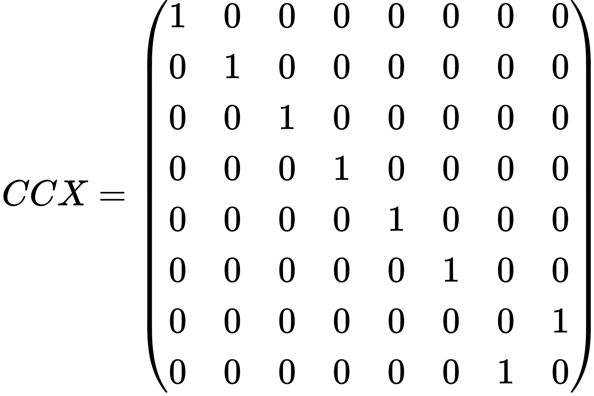

# QOSF Quantum Computing Mentorship Program


## Cohort 8 Screening Tasks - Task 3: Decomposition
Using the $U$ and $CX$ gates shown below, decompose the matrices to obtain $CCX$ and $CCCX$ gates. As a bonus, create a method for constructing any multi-controlled $X$ gate.

$$
U(\theta,\phi,\lambda)=
\begin{pmatrix} 
cos \frac{\theta}{2}\ & -e^{i\lambda} sin \frac{\theta}{2}\ \\\ 
e^{i\phi} sin \frac{\theta}{2}\ & e^{i(\phi+\lambda)} cos \frac{\theta}{2}\ 
\end{pmatrix}
$$

$$
CX=\begin{pmatrix} 
1 & 0 & 0 & 0 \\\ 
0 & 1 & 0 & 0 \\\ 
0 & 0 & 0 & 1 \\\ 
0 & 0 & 1 & 0 
\end{pmatrix}
$$

$$
CCX=\begin{pmatrix} 
1 & 0 & 0 & 0 & 0 & 0 & 0 & 0 \\\ 
0 & 1 & 0 & 0 & 0 & 0 & 0 & 0 \\\ 
0 & 0 & 1 & 0 & 0 & 0 & 0 & 0 \\\ 
0 & 0 & 0 & 1 & 0 & 0 & 0 & 0 \\\ 
0 & 0 & 0 & 0 & 1 & 0 & 0 & 0 \\\
0 & 0 & 0 & 0 & 0 & 1 & 0 & 0 \\\
0 & 0 & 0 & 0 & 0 & 0 & 0 & 1 \\\
0 & 0 & 0 & 0 & 0 & 0 & 1 & 0 \\\ 
\end{pmatrix}
$$




## 1. Creating the I (= Identity) Gate from the U gate 
$$
I=U(0,0,0)=\begin{pmatrix} 1 & 0 \\\ 0 & 1 \end{pmatrix}
$$

$$ 
{\left\lbrack \matrix{2 & 3 \cr 4 & 5} \right\rbrack} 
* \left\lbrack \matrix{1 & 0 \cr 0 & 1} \right\rbrack
= \left\lbrack \matrix{2 & 3 \cr 4 & 5} \right\rbrack
$$

**The Cauchy-Schwarz Inequality**

$\left( \sum_{k=1}^n a_k b_k \right)^2 \leq \left( \sum_{k=1}^n a_k^2 \right) \left( \sum_{k=1}^n b_k^2 \right)$

This sentence uses `$` delimiters to show math inline:  $\sqrt{3x-1}+(1+x)^2$

### Multi-Agent Deep Deterministic Policy Gradient (MADDPG) 
I implemented a MADDPG algorithm based on [Lowe et al.](https://arxiv.org/abs/1706.02275). The MADDPG algorithm is a general-purpose multi-agent learning algorithm that:

  1) Leads to learned policies that only use local information (i.e. their own observations) at execution time.
  2) Does not assume a differentiable model of the environment dynamics or any particular structure on the communication method between agents.
  3) Is applicable not only to cooperative interaction but to competitive or mixed interaction involving both physical and communicative behavior. 

Because the MADDPG algorithm is a multi-agent extension of the [Deep Deterministic Policy Gradient (DDPG) algorithm](https://arxiv.org/abs/1509.02971), it shares many features with the DDPG algorithm such as Replay Buffer, Soft Updates, [Batch Normalization](https://arxiv.org/abs/1502.03167.pdf), and Exploration ([Ornstein-Uhlenbeck process](https://journals.aps.org/pr/abstract/10.1103/PhysRev.36.823)). Please refer to the [previous project](https://github.com/ashikagah/DRLND_Continuous_Control/blob/master/Report.md) for the details of those features. 

One of the most important features of the MADDPG algorithm is that each critic receives the actions and state observations from all agents as inputs. This extra information enables **centralized training with decentralized execution**. It utilizes extra information to ease training, so long as this information is not used at test time. It is unnatural to do this with Q-learning, as the Q function generally cannot contain different information at training and test time. Thus, the MADDPG algorithm is a simple extension of actor-critic policy gradient methods where the critic is augmented with extra information about the policies of other agents.

### Hyperparameters
The final hyperparameters are as follows:
```
LEARN_EVERY = 1         # Learning - timestep interval
LEARN_NUM = 1           # Learning - number of learning passes
GAMMA = 0.99            # Learning - discount factor
LR_ACTOR = 5e-4         # Learning - learning rate of the actor
LR_CRITIC = 5e-4        # Learning - learning rate of the critic
BUFFER_SIZE = int(1e6)  # Replay Buffer - buffer size
TAU = 1e-3              # Soft Update - target parameters
BATCH_SIZE = 128        # Batch Normalization - minibatch size
OU_SIGMA = 0.2          # Exploration - Ornstein-Uhlenbeck noise parameter, volatility
OU_THETA = 0.12         # Exploration - Ornstein-Uhlenbeck noise parameter, speed of mean reversion
EPSILON = 1.0           # Exploration - initial value for epsilon in noise decay process in Agent.act()
EPSILON_DECAY = 1e-6    # Exploration - decay rate for noise process
```

### Model architecture
Both the actor and critic networks have two fully connected hidden layers, the first layer with 256 nodes and the second layer with 128 nodes. The actor network uses the tanh() activation function to limit all actions within the [-1, +1] range. When updating the critic network, it uses gradient clipping to place an upper limit on the size of the parameter updates.

## Plot of Rewards
My implementation of the MADDPG algorithm required 1,314 episodes to solve the environment. 


## Ideas for Future Work
The MADDPG algorithm required many iterations with hyperparameter tweaking. This is because the programmed stochasticity seems to play a major role in success/failure of convergence in my implementation. Repeating the training process with an identical set of hyperparameters does not lead to the same result. In addition, even in in the successful hyperparameter set, the number of episodes required to solve the environment remains high (>1000). To address those issues, I would like to use the Prioritized Experience Replay in my future implementation. 
